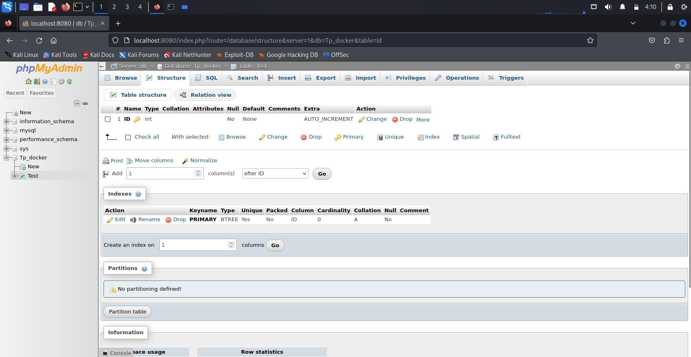

## 1.Installation Docker
## 2.Création dossier TP1
#__3. Exécuter un serveur apache__
- A.Image httpd
```bash
docker pull httpd:latest
```
- Version de docker
```bash
docker -v
```
- B.Vérification image
```bash
docker images
```
- Création dossier html et index.html dans le répo /tp_docker_1/

- C.Lancement apache avec notre fichier index.html
```bash
sudo docker run -d -p 8080:80 --name hello_world_httpd -v /home/kali/Documents/TP_Docker/TP_DOCKER_1/html/index>
```
- D.Suppression/arrêt du container
```bash
docker ps                        # Affiche les conteneurs en exécution (ps -a pour voir les conteneurs non éxécuté)
docker stop mon_conteneur_httpd  # Arrêter le conteneur s'il est en cours d'exécution
docker rm mon_conteneur_httpd    # Supprimer le conteneur
```

#__4. Exécuter dockerfile__
- A. Exécution apache avec dockerfile
```Dockerfile
Création du fichier dockerfile dans /tp_docker_1/

# Utilisation de l'image Apache officielle
FROM httpd:latest
# Copier le fichier index.html vers le répertoire /usr/local/apache2/htdocs/ du conteneur
COPY ./html/index.html /usr/local/apache2/htdocs/
# Définit le dossier de travail actuel
WORKDIR /usr/local/apache2/htdocs/
# Ouvre le lien entre docker et la machine en ouvrant le port 80
EXPOSE 80
```
- B. Exécution du dockerfile "build de notre nouvelle image contenant notre fichier html"
```bash
docker build -t nom_image .   # Nom image de votre choix !
```

- C. Exécution de la nouvelle image
```bash
docker run --name [MY_CONTAINER] -d -p 8080:80 [MY_IMAGE]    # MY_IMAGE = nom de votre image
```
- D. Différences docker-run | dockerfile
## Docker-run

| Avantages                         | Inconvénients                       |
| --------------------------------- | ----------------------------------- |
| Facilité de déploiement           | Dépendance aux conteneurs           |
| Isolation d'applications          | Consommation de ressources          |
| Gestion simplifiée des dépendances | Complexité potentielle              |
| Environnements reproductibles     | Taille des images Docker importante |

## DockerFile

| Avantages                            | Inconvénients                       |
| ------------------------------------ | ----------------------------------- |
| Reproductibilité des environnements  | Dépendance aux images Docker        |
| Contrôle précis des dépendances      | Taille parfois importante des images|
| Automatisation du processus de build | Complexité potentielle              |


#__5. Utilisation base de données dans un conteneur
- A. Récupération BDD mysql + phpmyadmin
```bash
docker pull mysql
docker pull phpmyadmin
```
- B. Exécution 2 conteneurs
```bash
$ docker run --name sql_docker -e MYSQL_ROOT_PASSWORD=my-secret-pw -d mysql:latest
$ docker run --name phpmyadmin -d --link sql_docker:db -p 8080:80 phpmyadmin

#Lors du lancement du conteneur docker phpmyadmin nous mettons --link "le nom du conteneur sql" cela permettra de relier la BDD a Phpmyadmin
```



#__6. Docker Compose__
- A. Dockercompose | Docker-run

|               | Docker-run                      | Docker Compose                                      |
|---------------|---------------------------------|------------------------------------------------------|
| **Description** | Lancer un conteneur Docker      | Gérer plusieurs conteneurs Docker avec simplicité     |
| **Utilisation** | Idéal pour déploiements simples | Pratique pour orchestrer des applications complexes  |
| **Exemple**     | `docker run -d -p 8080:80 --name mon_conteneur_httpd httpd:latest` | `docker-compose.yml` décrivant une application avec MySQL et PHP |


- B. Docker compose lancement et stop
```bash
docker-compose up -d    # Lancement docker-compose
docker-compose down     # Stop docker-compose
```
- C. Ecriture du docker-compose
```yaml
version: '3.8'

services:
  mysql:
    image: mysql:latest
    restart: always
    environment:
      MYSQL_ROOT_PASSWORD: password
    ports:
      - "3306:3306"
      
  phpmyadmin:
    image: phpmyadmin/phpmyadmin:latest
    restart: always
    environment:
      PMA_HOST: mysql
      PMA_PORT: 3306
      PMA_ARBITRARY: 1
    ports:
      - "8080:80"
```
