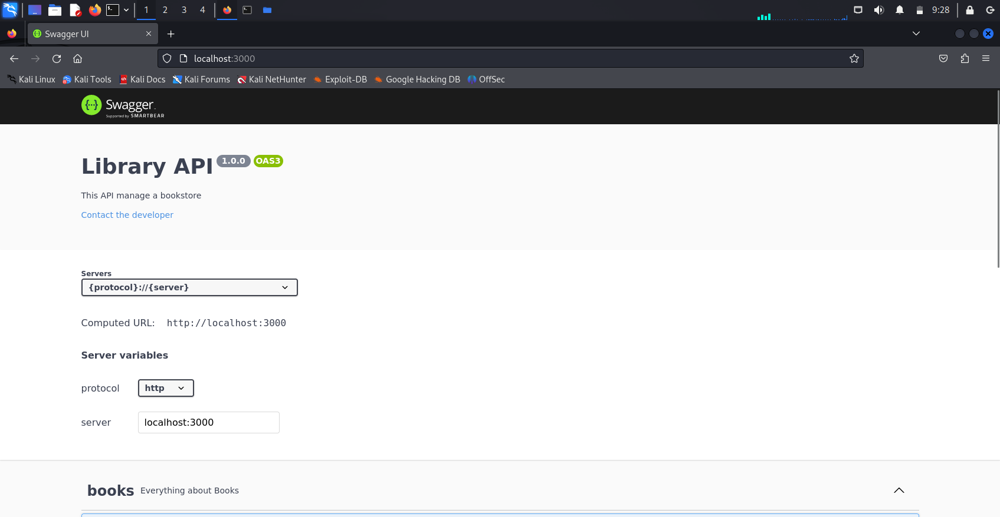

# Création dossier TP_DOCKER_2
# 1.Récupération du code
Dans /src/

# 2. Création d'un dockerfile pour node.js

```dockerfile
FROM node:20-alpine
WORKDIR /app

COPY ./src ./
RUN npm install

CMD ["node","server.js"]
EXPOSE 3000
```
- Installation de "Dive" pour afficher des informations supplémentaires sur les images dockers.
```bash
$ docker pull wagoodman/dive   
```
- Lancement de la commande par un docker
```bash
$ docker run --rm -it -v /var/run/docker.sock:/var/run/docker.sock wagoodman/dive:latest node_docker
```

- Une fois le build ok éxécuter les commandes suivantes :
```bash
docker build -t node_docker .
docker run -dp 3000:3000 node_docker
```


- Modification fichier "db.config.js"
```js
// Uncomment this block to use sqlite
/*module.exports = {
    dialect: "sqlite",
    storage: "./my-db.sqlite",
}*/

// Uncomment this block to use mysql
module.exports = {
    hostname: "sql_docker",
    username: "root",
    password: "password",
    database: "mysql",
    port: 3306
}

// TODO : adapt this file to load parameters from environment variables (process.env.VARIABLE_NAME)
```
- Modification fichier "index.js" dans /src/models/
```js
const { Sequelize } = require('sequelize');
const dbConfig = require('../db.config');

// Uncomment this block to use Mysql, don't forget to adapt db.config.js
const instance = new Sequelize(dbConfig.database, dbConfig.username, dbConfig.password, {
        host: dbConfig.hostname,
        port: dbConfig.port,
        dialect: "mysql"
});

// Uncomment this block to use Sqlite, don't forget to adapt db.config.js
/*const instance = new Sequelize({
    dialect: dbConfig.dialect,
    storage: dbConfig.storage
});*/

module.exports = {
    instance,
    books: require('./books')(instance)
};
```
- Création d'un network pour les lancements des containers
```bash
docker network create --subnet=172.18.0.0/16 --gateway=172.18.0.1 perso_network
```
- Lancement docker mysql
```bash
docker run --name sql_docker -e MYSQL_ROOT_PASSWORD=password -p 3306:3306 --network perso_network -d mysql:latest
```
- Lancement docker node
```bash
docker run -p 3000:3000 --network perso_network node_docker
```

# 5. Création docker-compose.yml

```yml
version: '3.8'

services:
  bdd:
    image: mysql:latest
    container_name: bdd_dock
    environment:
      MYSQL_ROOT_PASSWORD: password
    expose:
      - 3306
    networks:
      - perso_network

  node:
    build:
      context: ./
      dockerfile: dockerfile.node
    container_name: node_dock
    restart: always
    environment:
      DB_HOST: bdd
      DB_PORT: 3306
    ports:
      - "3000:3000"
    networks:
      - perso_network

networks:
  perso_network:
    driver: bridge
                 
```
Par pécaution j'effectue un "docker image prune" et "docker container prune"
Ensuite je relance la commande docker-compose -up et le message node.js "Server running" est censé s'afficher.


- Q1: Une erreur sera indiqué comme quoi le port est déjà utilisé
- Q2: Pour n'installer que les dépendances de production il faut utiliser "npm install --production"
- Q2.1: Cela permet une economie d'espace disque, de la sécurité, des performances ainsi que la conformité
- Q3 : ?
- Q4 : Si on laisse localhost en hostname pour appeler la BDD, cela revient a s'appeler soit même c'est pour cela qu'il faut a la place mettre le nom du service, container pour qu'il puisse communiquer avec la BDD qui a également son expose < port > 
